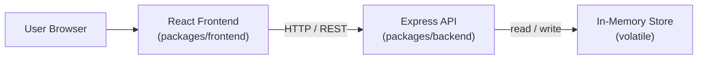
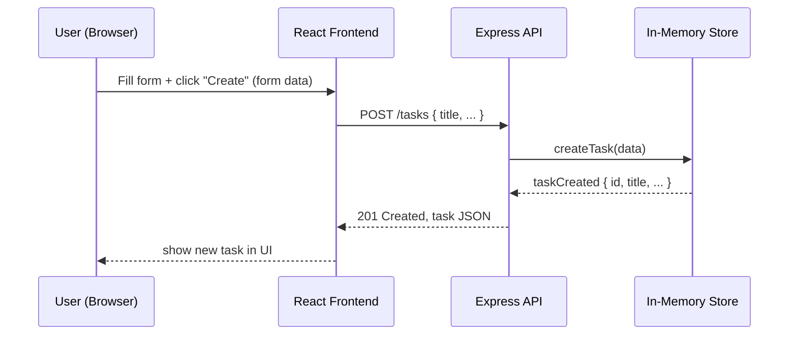

# Cloud Architecture Overview

A simple system-context diagram for this monorepo: React frontend + Express API + in-memory store.

Notes:
- Frontend: single-page React app that runs in the user's browser.
- API: Express server serving JSON endpoints used by the frontend.
- Store: simple in-memory data store kept by the API (no external DB in this setup).

## Sequence: Creating a TODO

This sequence shows the user submitting a task from the React frontend, the frontend calling the Express API, the API persisting in the in-memory store, and the responses flowing back to update the UI.
